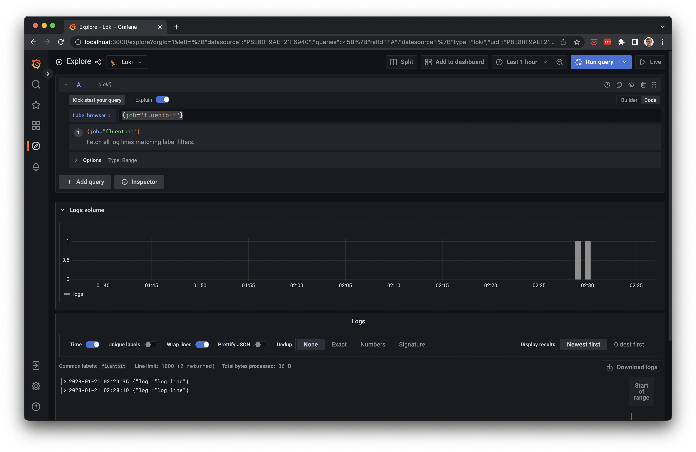

# 🔬 Fluentbit + Loki Laboratory 🔬

Setup a local laboratory 🧪 to explore Fluenbit and Loki

## Usage

Start services:

```bash
docker-compose up -d
```

This starts the following services:

- Grafana: local instance of Grafana exposed at <http://localhost:3000>
  - This instance is configured with a Loki datasource named "Loki"
- Fluentbit: an instance of Fluentbit configured with the following [config](./config/fluentbit/main.conf)
- Promtail: an instance of Promtail configured to scrape logs from Docker containers. Use label `container` to query for logs of each container.

## Testing log ingestion

Fluentbit is configured to tail any `*.log` file written into `test_logs` on the host. Simply do:

```bash
echo '{"message": "lorem ipsum" "foo":"bar"}' >> test_logs/file.log
```

Or manually create/edit files under `test_logs` directory

## Consulting ingested logs

- Access Grafana on <http://localhost:3000/explore>
- Query for logs whose label `job` is `fluentbit`. E.g. LogQL query `{job="fluentbit"}`



## References

- Based off <https://github.com/grafana/loki/tree/main/examples/getting-started>
